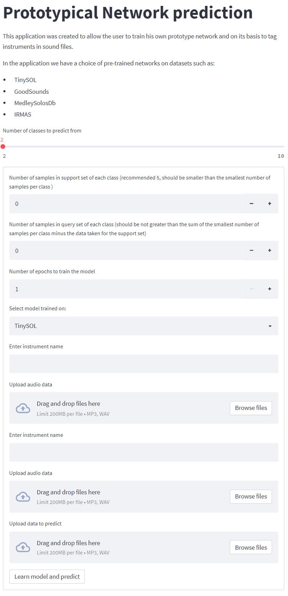

MIR_inzynierka
==============================

MIR BEng Thesis "Etykietowanie muzyki (music tagging) za pomocą metod sztucznej inteligencji"

# Prototypical Network prediction APP

This application was created to allow the user to train his own prototype network and on its basis to tag instruments in sound files.

To run the applications, go to the *src* folder and then run the main program
```
cd src
streamlit run main.py
```




Project Organization
------------

    ├── README.md          <- The top-level README for developers using this project.
    ├── data
    │   ├── external       <- Data from third party sources.
    │
    ├── models             <- Trained and serialized models, model predictions, or model summaries
    │
    ├── notebooks          <- Jupyter notebooks. Naming convention is a number (for ordering),
    │                         the creator's initials, and a short `-` delimited description, e.g.
    │                         `1.0-jqp-initial-data-exploration`.
    │
    ├── reports            <- Generated analysis as HTML, PDF, LaTeX, etc.
    │
    ├── requirements.txt   <- The requirements file for reproducing the analysis environment, e.g.
    │                         generated with `pip freeze > requirements.txt
    ├── src                <- Source code for use in this project.
        ├── __init__.py    <- Makes src a Python module
        │
        ├── main.py           <- Main program
            └── make_dataset.py


--------

<p><small>Project based on the <a target="_blank" href="https://drivendata.github.io/cookiecutter-data-science/">cookiecutter data science project template</a>. #cookiecutterdatascience</small></p>
